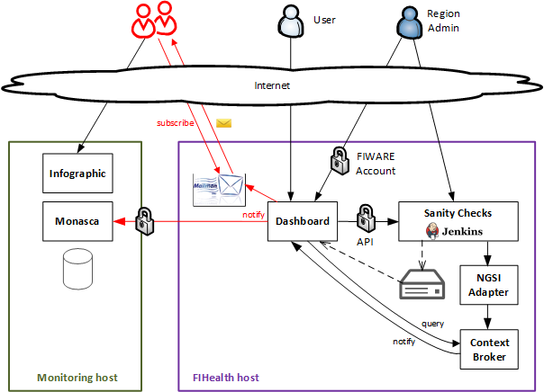

===============================================
 FIWARE Health - Sanity Check Status Dashboard
===============================================

.. contents:: :local:

Introduction
============

This is the code repository for **FIHealth - Dashboard**, an overview page with
a summary of the status of the regions in `FIWARE Lab`_ including links to the
reports showing detailed information about the problems found.

The dashboard is one of the components of `FIHealth </README.rst>`_, which is
part of the `FIWARE Ops`_ suite of tools for the operation of FIWARE Lab.

This project is part of FIWARE_.

Any feedback on this documentation is highly welcome, including bugs, typos or
things you think should be included but aren't. You can use `github issues`__
to provide feedback.

__ `FIHealth - GitHub issues`_

Overall description
===================

This dashboard is a tool to graphically monitor the *health* of the nodes in
FIWARE Lab. It allows end users and node administrators to know which
capabilities of a region are working.

As the frontend for `Sanity Checks </fiware-region-sanity-tests/README.rst>`_,
the dashboard shows all test results of each execution and the sanity check
status of each region. It makes possible to browse through executed test cases
and their results; in case of failure, detailed logs are shown.

Additionaly, it allows administrators to re-launch the Sanity Checks execution
(this requires to sign in using FIWARE Account credentials) and to subscribe
to mail notifications about changes in a region status. Such changes are also
published as *metrics* into Monasca_.

Build and Install
=================

Dashboard is distributed as a CentOS (.rpm) package ready to be installed. For
details about building from sources and packaging, please check `this document
<doc/build_source.rst>`_.

Requirements
------------

- Operating systems: CentOS (or RedHat), being CentOS 6.3 the reference version
- RPM dependencies: some required packages may not be present in the official
  repositories, or their versions are too old (for example, ``nodejs``). In any
  case, checking for such dependencies and configuration of alternative sources
  is automatically managed by the package installation scripts when using the
  proper tool (i.e. ``yum``)

Installation
------------

Using FIWARE package repository (recommended)
~~~~~~~~~~~~~~~~~~~~~~~~~~~~~~~~~~~~~~~~~~~~~

Refer to the documentation of your Linux distribution to set up the URL of the
repository where FIWARE packages are available (and update cache, if needed).
Currently, ``http://repositories.lab.fiware.org/repo/rpm``

Then, use the package tool to install ``fiware-fihealth-dashboard``::

    $ sudo yum install fiware-fihealth-dashboard

Using a downloaded RPM file
~~~~~~~~~~~~~~~~~~~~~~~~~~~

Download the package file and install it. Take into account that you may need
to manually install dependencies, as some tools aren't able to manage them when
installing from file::

    $ sudo rpm -i fiware-fihealth-dashboard-X.Y.Z-1.noarch.rpm

Post-installation
-----------------

Mailman_ and mailman-api_ are installed as dependencies of this component,
given that notifications are sent via mailing lists. After checking values for
configuration options in file ``/etc/sysconfig/fihealth_dashboard.yml``, some
additional steps are required after installation:

-  Customize subscription message by editing file
   ``{mailman-lib-path}/templates/en/subscribeack.txt``:

.. code::

   Welcome to the %(real_name)s@%(host_name)s mailing list!
   %(welcome)s
   To unsubscribe, please visit http://%(host_name)s/.

-  Set mail host at ``{mailman-lib-path}/Mailman/mm_cfg.py``:

.. code::

   DEFAULT_URL_HOST   = 'myhost.mydomain.tld'
   DEFAULT_EMAIL_HOST = 'myhost.mydomain.tld'
   DEFAULT_HOST_NAME  = 'myhost.mydomain.tld'

-  Set mail transport agent (many supported, but Postfix_ recommended) at
   ``{mailman-lib-path}/Mailman/mm_cfg.py`` (some further configuration steps
   could be required: please follow directions at `Mailman documentation`__):

   __ `Mailman - Set up your mail server`_

.. code::

   MTA = 'Postfix'

   # These variables describe the program to use for regenerating the aliases.db
   # and virtual-mailman.db files, respectively, from the associated plain text
   # files.  The file being updated will be appended to this string (with a
   # separating space), so it must be appropriate for os.system().
   POSTFIX_ALIAS_CMD = '/usr/sbin/postalias'
   POSTFIX_MAP_CMD = '/usr/sbin/postmap'

-  Configure message footer at ``{mailman-lib-path}/Mailman/mm_cfg.py``:

.. code::

   # These format strings will be expanded w.r.t. the dictionary for the
   # mailing list instance.
   DEFAULT_MSG_FOOTER = """_______________________________________________
   FIHealth Sanity Checks
   http://%(host_name)s/
   """

-  Create the mailing lists and subscribe to Context Broker:

.. code::

   $ cd {installation_path}/bin
   $ setup

Upgrading from a previous version
---------------------------------

Unless explicitly stated, no migration steps are required to upgrade to a
newer version of the Monitoring components:

- When using the package repositories, just follow the same directions
  described in the Installation_ section (the ``install`` subcommand also
  performs upgrades).
- When upgrading from downloaded package files, use ``rpm -U``.

Running
=======

Dashboard runs as a standalone web server listening for requests at the given
endpoint. Once installed, there are two ways of starting the server: manually
from the command line or as a system service ``fihealth_dashboard`` created by
the package installation (preferred). It is not recommended to mix both ways
(e.g. start it manually but using the service scripts to stop it).

From the command line
---------------------

First of all, create a custom configuration file ``config/dashboard.yml`` from
sample found at the same directory. Then, simply type:

.. code::

   $ cd {installation_path}/bin
   $ dashboard

You can use command line arguments to override values given in the configuration
file, e.g. to specify the listen port:

.. code::

   $ dashboard --listen-port=8081

Help for command line options:

.. code::

   $ dashboard --help

As system service
-----------------

Use the ``fihealth_dashboard`` service:

.. code::

   $ sudo service fihealth_dashboard start
   $ sudo service fihealth_dashboard stop

Configuration file
------------------

Although some options can be specified from the command line, as a general rule
the use of a configuration file is preferable:

- ``/etc/sysconfig/fihealth_dashboard.yml`` (when running system service)
- ``{installation_path}/config/dashboard.yml`` (when running manually)

Such configuration file is self-documented, so there you will find a description
of every configuration option.

**Important**: If your region's admin username does not match pattern
*admin-{regionName}*, you must include it in property ``regionsAuthorized``
at section ``idm`` in the configuration file.

Testing
=======

End-to-end tests
----------------

In order to test the status of the dashboard, first check whether the server is
running and then try accessing the main page from a browser:

.. code::

   $ service fihealth_dashboard status

Unit tests
----------

Please refer to `building from sources documentation <doc/build_source.rst>`_:
the ``test`` target is used for running the unit tests for the dashboard.

.. REFERENCES

.. _FIWARE: http://www.fiware.org/
.. _FIWARE Lab: https://www.fiware.org/lab/
.. _FIWARE Ops: https://www.fiware.org/fiware-operations/
.. _FIHealth - GitHub issues: https://github.com/telefonicaid/fiware-health/issues/new
.. _Postfix: http://www.postfix.org/
.. _mailman-api: http://mailman-api.readthedocs.org/en/stable/
.. _Mailman: http://www.gnu.org/software/mailman/
.. _Mailman - Set up your mail server: http://www.gnu.org/software/mailman/mailman-install/mail-server.html
.. _Monasca: https://wiki.openstack.org/wiki/Monasca
